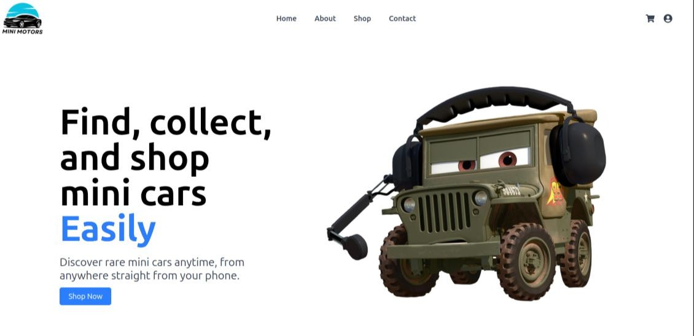
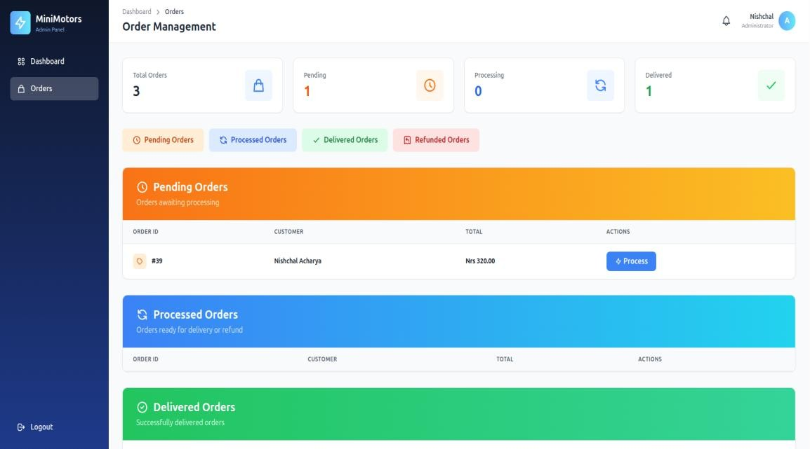
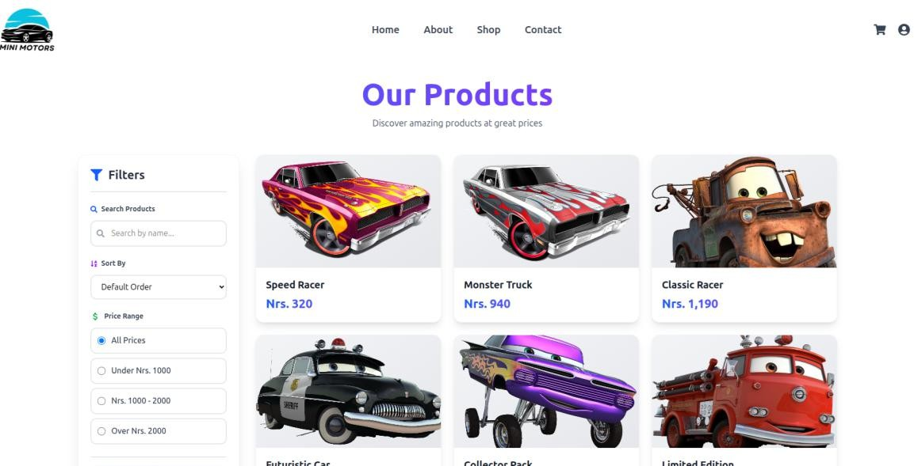
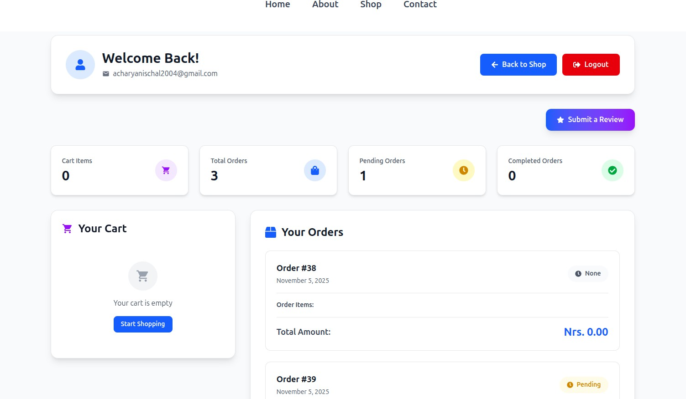
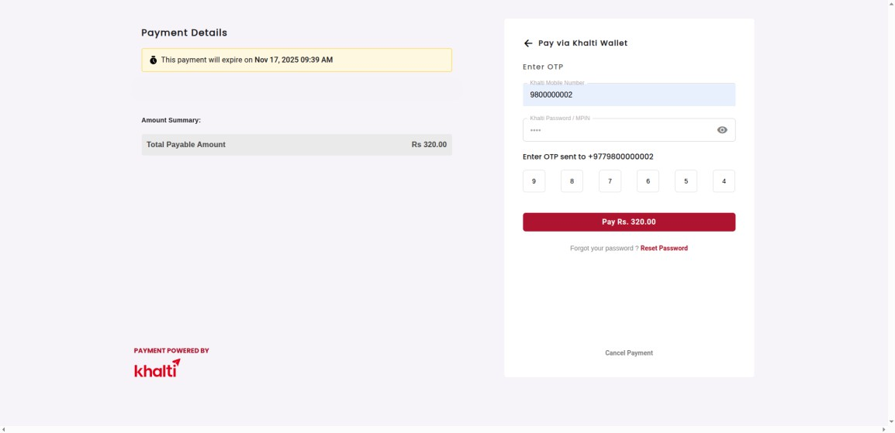

# 🏎️ MiniMotors — Hot Wheels E-Commerce Platform

**MiniMotors** is a full-stack **e-commerce web application** built with **React (Frontend)** and **Laravel (Backend API)**.
It’s designed for Hot Wheels car lovers to browse, order, and track their favorite collectibles.
Admins can manage products, process orders, and update their delivery status — all from a clean dashboard.

---
### Home page
 
### order page

### Shoppage
 
### userdashboard 

### khalti Integration
  

## 🚀 Features

### 🧾 User Features

* 🛒 **User Registration & Login** (Email-based system)
* 🔍 **Browse Products** by category
* 🧺 **Add to Cart** and manage cart items
* 💳 **Checkout via Khalti (Test Mode)**
* 📦 **Order Tracking** — view order status (*Pending*, *Processed*, *Delivered*, *Refunded*)
* 📨 **Order Confirmation Email** after successful purchase
* 👤 **Personal Dashboard** — view all past orders

---

### 🧰 Admin Features

* 🔐 **Secure Admin Login Panel**
* 🧮 **View & Manage All Orders**
* ⚙️ **Update Order Status** (*Pending → Processed → Delivered / Refunded*)
* 🧾 **View User Info & Purchase Details**
* 🧱 **Add / Edit / Delete Products**
* 📊 **View Product List and Total Orders**

---

## 🧩 Tech Stack

| Layer               | Technology                               |
| ------------------- | ---------------------------------------- |
| **Frontend**        | React, React Router, Axios, Tailwind CSS |
| **Backend**         | Laravel 10 (RESTful API)                 |
| **Database**        | MySQL                                    |
| **Payment Gateway** | Khalti (Test Mode)                       |
| **Authentication**  | Email Login (LocalStorage based)         |
| **Mail System**     | Laravel Mail (SMTP)                      |
| **Image Storage**   | Laravel File Storage (Public Disk)       |

---

